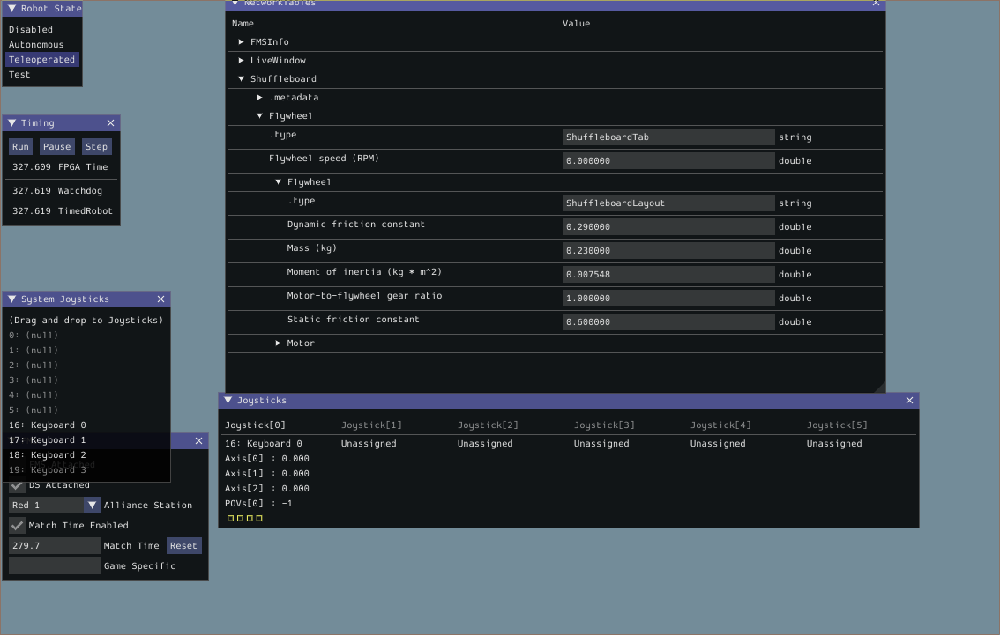
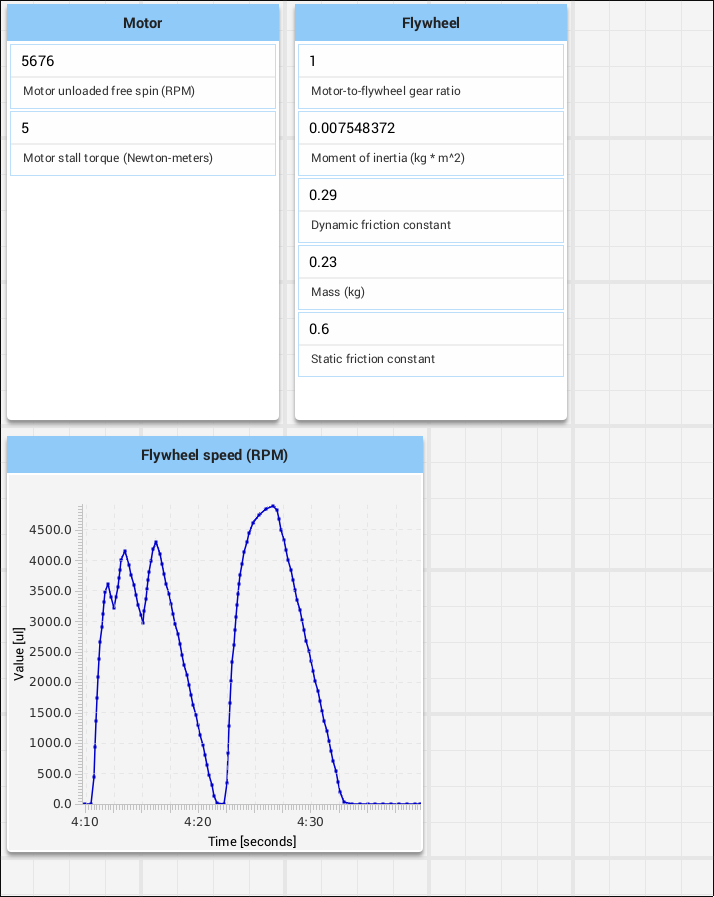

# Flywheel drive simulator

This project simulates a flywheel driven by a single motor, with one encoder attached to the flywheel.

## How to use

The project uses WPILib and the integrated Shuffleboard dashboard generator to visualize a flywheel
and modify its physics. Your team can use this to play around with flywheel behavior with different
properties (gear ratios, mass, friction coefficients) and build a controller to operate your
flywheel at a desired RPM.

To get started:

* [Install WPILib](https://docs.wpilib.org/en/stable/docs/zero-to-robot/step-2/wpilib-setup.html)
* Open this directory in WPILib's vscode install
* Run the simulator with ctrl-F5 or, from the menu, "Run -> Run Without Debugging."
* If prompted run the `Sim GUI` extension 
* Once the simulator control appears, bind a keyboard to controller 1 and switch to the Teleoperated game phase
  (more information on using the simulator control can be found [here](https://docs.wpilib.org/en/stable/docs/software/wpilib-tools/robot-simulation/simulation-gui.html))
* Launch the Shuffleboard to see and modify the flywheel parameters: in vscode, Ctrl-shift-P to bring up
  the palette, and type `WPILib: Start Tool`. Select this, then select `shuffleboard.`
* Once Shuffleboard is launched, return to the Simulation GUI and press the key corresponding to "A" on the controller
  to spin up the flywheel. You'll see the flywheel RPMs in the graph in shuffleboard. 

## Disclaimer

The physics simulation is not guaranteed to be accurate. Always test your code on a real robot to
confirm it works as intended.